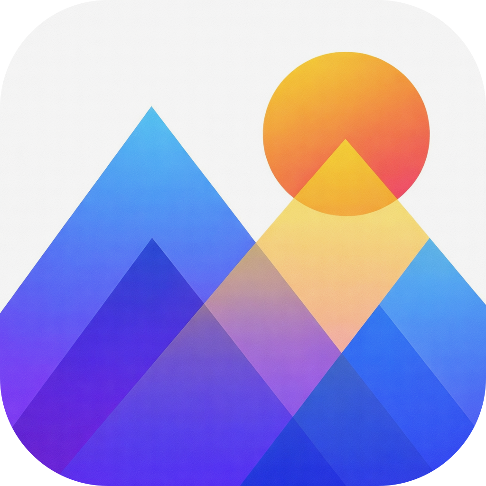

<p align="center">
  
</p>

<h1 align="center">ImgZen</h1>

<p align="center">
  The image converter for iPhone and iPad: JPEG, HEIC, WebP, PNG, TIFF and BMP, converted on your device.
</p>

<p align="center">
  
  
  
  
  
  
  
  <a href="LICENSE"></a>
  <a href="https://github.com/LinkAndreas/ImgZen/actions/workflows/deploy.yml"></a>
</p>

<p align="center">
  <a href="https://apps.apple.com/app/id6757331137">App Store</a> ·
  <a href="https://imgzen.linkandreas.de">Website</a> ·
  <a href="https://imgzen.linkandreas.de/privacy/en/">Privacy Policy</a>
</p>

## Features

- 🖼️ **Six formats** — convert between JPEG, HEIC and WebP (lossy) and PNG, TIFF and BMP (lossless).
- 🎚️ **Four quality levels** for lossy formats — Low, Medium, High (recommended) and Maximum — each explained in
  the app.
- 📦 **Batch conversion** — convert many images at once, with a progress card you can cancel.
- 📥 **Photos and Files** — pick from your photo library or the Files app; drag and drop on iPad.
- 📤 **Review and share** — the results open in a sheet: choose which images to share and send them anywhere.
- 📱 **iPhone, iPad and iPhone Duo** — the output format sits in an inspector beside the images on iPad, and the
  toolbar moves into the vertical bar on iPhone Duo.
- 🔒 **Private** — no photo library permission, no account, no analytics; everything happens on the device.
- ❤️ **Free** — with optional tips and support subscriptions that unlock nothing
  ([setup](Docs/AppStoreConnect-Support.md)).

## Privacy

- **No photo library permission** — the system photo picker only gives ImgZen the images you select.
- **On-device processing** — conversions happen entirely on the device; nothing is uploaded.
- **No data collection** — no personal data, analytics or tracking. Copies of the picked images and the converted
  files are temporary and removed at the next launch.

See the [Privacy Policy](https://imgzen.linkandreas.de/privacy/en/).

## Building from source

```bash
git clone https://github.com/LinkAndreas/ImgZen.git
cd ImgZen
open ImgZen.xcodeproj
```

Build and run with ⌘R. Swift Package Manager resolves the one dependency,
[SDWebImageWebPCoder](https://github.com/SDWebImage/SDWebImageWebPCoder), for WebP support.

The shared `ImgZen` scheme runs with `Config/ImgZen.storekit`, so Support the Developer can be tried without App
Store Connect — see [Docs/AppStoreConnect-Support.md](Docs/AppStoreConnect-Support.md).

## Project structure

```
ImgZen/
├── App.swift                 # Entry point, Support the Developer store
├── Domain/                   # Models and services
│   ├── ImageConversion/      # Formats and conversion
│   ├── Services/             # Conversion, storage, input, Support the Developer store
│   └── Support/              # Support product IDs and the store service protocol
├── Infrastructure/           # Repositories, StoreKit, launch cleanup
├── Presentation/             # Format titles and subtitles
├── UI/
│   ├── Components/           # Gallery, format settings, progress, celebration
│   └── Screens/              # Onboarding, input, results, Support the Developer
├── Extensions/               # SwiftUI helpers (vertical bars, progress overlay, mail)
├── Logging/
└── Resources/                # Assets, localization, launch screen, settings bundle
Config/ImgZen.storekit        # Local StoreKit testing
Docs/                         # App Store Connect setup
```

## Testing

Unit tests use Swift Testing. Run them with ⌘U in Xcode, or:

```bash
xcodebuild test -project ImgZen.xcodeproj -scheme ImgZen -destination 'platform=iOS Simulator,name=iPhone 17 Pro'
```

See [ImgZenTests/README.md](ImgZenTests/README.md).

## Releasing

Every merge into `main` builds the app on a self-hosted Mac and uploads it to App Store Connect
(`.github/workflows/deploy.yml`).

- **Git Flow**: `feature/*` → `develop`, then `release/<version>` (bumps `MARKETING_VERSION`) → `main`, tagged with
  the version and merged back into `develop`.
- **Commits** follow [Conventional Commits](https://www.conventionalcommits.org/): `feat:`, `fix:`, `chore:`,
  `test:`, `docs:`.

## Licenses

The code is available under the [MIT License](LICENSE). The licenses of the dependencies shown in the app's
Settings are generated with [LicensePlist](https://github.com/mono0926/LicensePlist):

```bash
license-plist --output-path ./Settings.bundle --add-version-numbers
```
